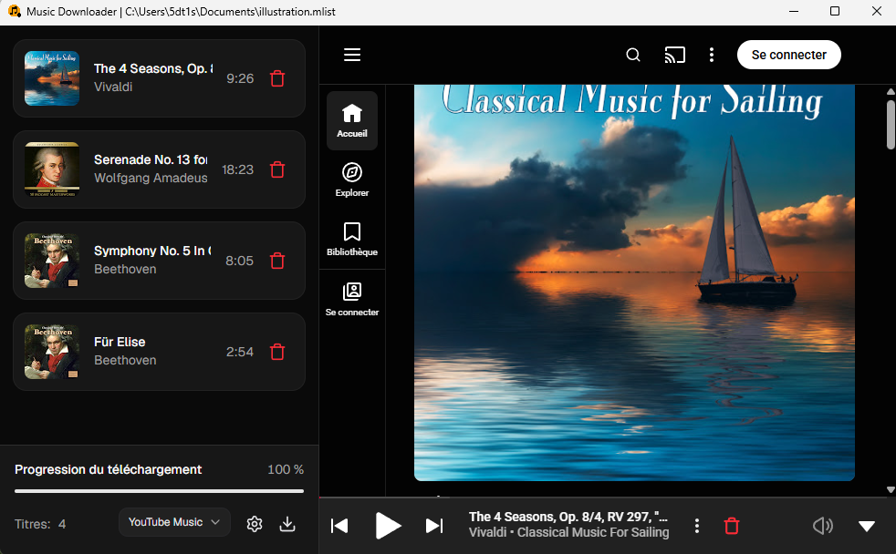

<div align="center">
  
  <h1>Music Downloader</h1>
  <p>A simple and intuitive desktop application to download songs from YouTube Music.</p>
  
</div>

## Features
- **Download Queue:** 
Browse and listen to songs directly in the app, then queue them up for download.
- **Queue Saving:** 
Export or save your download queue to a playlist file to finish downloading later.
- **Format & Quality Selection:** Choose your preferred audio format and bitrate for downloads (MP3, OPUS, M4A).
- **Embedded Tags:** Automatically tags downloaded files (artist, title, album and artwork).
- **Built-in Ad Blocker:** Removes ads while browsing to keep playback uninterrupted.
- **Cross Platform:** Native builds for Windows and Linux.
- **Multi Language Support:** Available in multiple languages (English and French for now).
- **Bundled Binaries:** Ships with all required binaries no manual setup needed.

## Installation
| Platform | File Format | Notes |
| :--- | :--- | :--- |
| **Windows** | `.exe` (NSIS Installer) | Standard one-click installer |
| **Linux (Universal)** | `.AppImage` | Make executable (`chmod +x`) and run |
| **Linux (Debian / Ubuntu / Mint)** | `.deb` | `sudo apt install ./*.deb` |

>Note: No macOS version due to Apple's signing process, which makes unsigned apps a nightmare to launch.

## Development

### Prerequisites

- **Node 24 or higher**
- **Windows / Linux environment**

### Setup
```bash
# Clone the repository
git clone git@github.com:cinqdtun/Music-Downloader.git
cd Music-Downloader
# Install npm dependencies
npm ci
# Install electron binaries
node node_modules/electron/install.js
```


### Commands

| Command | Description |
| :--- | :--- |
| `npm run clean` | Remove all compilation artifacts | 
| `npm run lint` | Analyze code and report errors | 
| `npm run dev`| Start app in devloppement mode | 
| `npm run build:linux`| Compile code for Linux | 
| `npm run package:linux` | Build code and package application for Linux | 
| `npm run build:win` | Build code for Windows | 
| `npm run package:win` | Build code and package application for Windows | 

### Stack
- **Frontend:** React, TypeScript, Tailwind CSS
- **UI:** shadcn/ui, Lucide Icons
- **Desktop Shell:** Electron
- **Build Tool:** electron-vite
- **Packager:** electron-builder
- **Dependencies:** `yt-dlp`, `FFmpeg`, `quickjs` (bundled)

## Disclaimer

**1. General & Educational Purpose**

This software is developed strictly for educational and research purposes. It is provided "as is" without warranty of any kind, either express or implied.

**2. No Affiliation**

This project is an independent tool and is not affiliated, associated, authorized, endorsed by, or in any way officially connected with YouTube, Google LLC, or any of their subsidiaries or affiliates. All product and company names are trademarks™ or registered® trademarks of their respective holders.

**3. Copyright & Fair Use**

This software does not host, store, or distribute any copyrighted media. It functions solely as a client-side utility to download content accessible to the user. Users are solely responsible for ensuring that their use of this software complies with all applicable local, national, and international copyright laws, fair use doctrines, and YouTube’s Terms of Service.

**4. User Responsibility**

The author(s) and contributor(s) do not condone, encourage, or support the unauthorized downloading, distribution, or reproduction of copyrighted material. Any use of this tool on content where the user does not hold the copyright, explicit permission from the copyright owner, or a valid legal exemption is strictly prohibited. The end-user assumes all liability for any misuse or legal consequences arising from the operation of this application.

## License

This project is licensed under the [MIT License](./LICENSE).
